> **Capabilities over applications.**
> **Runtime before products.**  
> **Local before cloud.**  

# ⚡ Frankn

> **A private, local-first P2P networking runtime for distributed devices.**  
> *Program your devices, not their ecosystems. Build capabilities once, expose them anywhere.*

Frankn is a **capability-oriented networking runtime** for connecting applications, hosts, and physical devices over authenticated peer-to-peer sessions.

The project started as a more abstract idea around remote administration, automation, device control, and local inference. Its architecture has now converged on a clearer model:

**Frankn is a networking runtime built around capabilities and nodes.**

A **Frankn Host** is the authoritative controller for a private network.  
A **Frankn Node** is a runtime installed on a device that exposes the capabilities that device can provide.  
A **Frankn Client** discovers those capabilities and uses them through secure P2P sessions.  
A **Signaling Server** helps peers find one another and establish WebRTC connections, but it is not the application data path.

This makes the architecture deliberately different from a traditional cloud-connected device platform:

- Devices do not need to expose their capabilities through unrelated proprietary APIs.
- The host does not need to understand every hardware implementation.
- Nodes advertise what they can do.
- Clients discover capabilities dynamically.
- Capability traffic moves over authenticated, encrypted P2P connections whenever possible.

Applications can therefore be assembled from capabilities rather than being permanently coupled to specific devices.

> **Applications solve problems.**  
> **Platforms compose solutions.**  
> **Frankn provides the networking runtime underneath them.**

---

## 📜 Philosophy

Modern software tends to organize the world around applications and vendor-specific ecosystems.

Frankn takes the opposite approach.

A camera is not "a camera application." It is a **camera capability**.

A thermostat is not "a thermostat application." It is a **thermostat capability**.

A TV, light, filesystem, terminal, media controller, sensor, or inference engine can all follow the same model.

The application should not need to know how the underlying device implements its capability. It should only need to understand the capability contract.

That gives Frankn a simple architectural rule:

> **Nodes provide capabilities. Hosts coordinate them. Clients consume them.**

The runtime stays relatively stable while the capabilities and products built on top of it evolve.

> **Engineering Discipline:** *Every new capability should make the runtime more reusable, not merely make one application larger.*

---

## 💡 What is Frankn?

Frankn consists of four major pieces:

| Component | Responsibility |
| :--- | :--- |
| **Frankn Host Runtime** | Authoritative controller, capability discovery, session coordination, policy, and runtime state. |
| **Frankn Node Runtime** | Runs on a physical/virtual device and advertises the capabilities enabled for that node. |
| **Frankn Client App / SDK** | Discovers nodes and capabilities and provides user-facing controls and views. |
| **Frankn Signaling Infrastructure** | Provides peer discovery, WebRTC signaling, SDP exchange, ICE coordination,. |

### The important distinction

The **signaling server is infrastructure, not the application's transport layer**.

It helps the Host, Nodes, and Clients establish a peer connection.

Once the P2P session is established, capability traffic should travel directly between the participating peers through **WebRTC**, rather than through the signaling server.

This separation is fundamental to Frankn's privacy and local-first design.

---

### Architecture Diagram

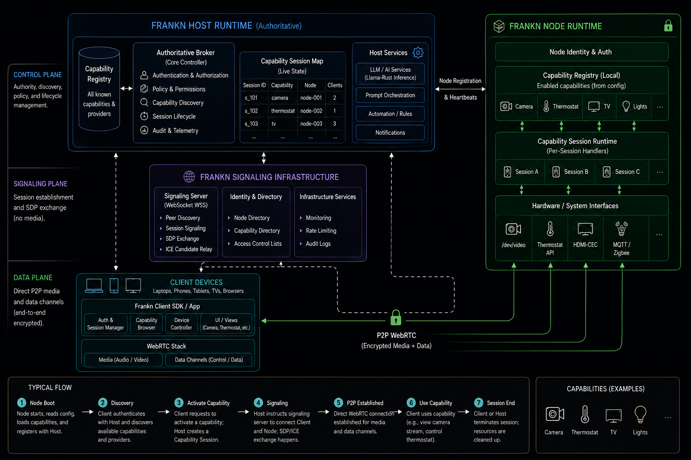

The diagram above is the architectural reference for the current Frankn model.

## 🌐 The Frankn Node


A node can run on:

- 🖥️ Linux workstations and servers
- 💻 macOS systems
- 🥧 Raspberry Pi/Orange Pi (most other SBC), edge devices and embedded computers
- 🤖 Future robotics and industrial hardware

The Node Runtime is intentionally **capability-driven**.

Instead of hard-coding every possible device type into the runtime, the node loads its enabled capabilities from its runtime configuration.

For example:

```toml
[capabilities]
camera = true
thermostat = true
tv = true
lights = true
```

The exact configuration format can evolve independently from the capability protocol. The important architectural contract is:

1. Node Runtime starts.
2. Node Runtime loads its configuration.
3. Enabled capabilities are initialized.
4. Node authenticates with the Host.
5. Node advertises its available capabilities.
6. Host records the node and its capabilities.
7. Clients can discover those capabilities.
8. A capability session is created when a client wants to use one.
9. The Node Runtime dispatches the session to the appropriate capability implementation.

This means the Host does **not** need to know that a particular camera is `/dev/video0`, that a thermostat uses a particular vendor API, or that a lighting system happens to use MQTT.

The Node owns that hardware-specific knowledge.

---

## 🧩 Capability Model

A capability is a **well-defined service exposed by a node**.

Conceptually:

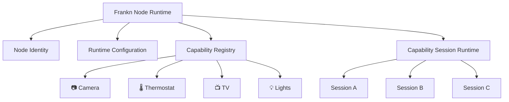

### Capability advertisement

When a node connects to the Host, it advertises the capabilities currently enabled by its runtime configuration.

A capability advertisement should describe at least:

- Capability identifier
- Capability type
- Capability version
- Node identifier
- Availability / current status
- Supported operations or features
- Transport requirements, when relevant
- Capability-specific metadata

The Host can therefore maintain a live view of:

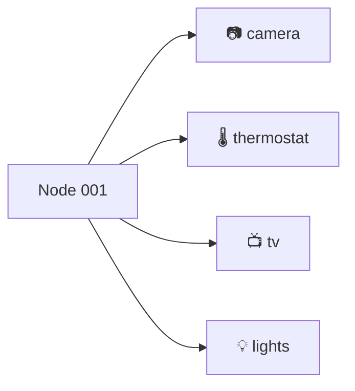

The client does not need a hard-coded list of every possible device in the world. It can discover what exists on the network and build its UI around the advertised capability set.

---

## 📷 Camera Capability

The camera capability is an important example of why the Node Runtime model matters.

The Node Runtime owns the hardware interface:

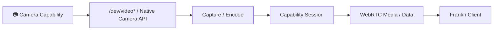

The **Client should not directly access the camera hardware**.

Instead:

1. The client discovers a node advertising `camera`.
2. The client requests a camera capability session.
3. The Host authorizes and coordinates the session.
4. The Node creates the camera session.
5. The Node captures frames from the local camera interface.
6. The Node publishes the resulting media through the established P2P WebRTC session.
7. The Client renders the camera stream.

This is the same architectural pattern that can later support thermostats, TVs, lights, sensors, microphones, actuators, and other physical interfaces.

> **Hardware access belongs to the Node. Capability semantics belong to the protocol. Presentation belongs to the Client.**

---

## 🏗️ Whole-System Architecture

The high-level architecture is divided into three logical planes:

### 1. 🎛️ Control Plane

Responsible for:

- Node identity and authentication
- Capability discovery
- Authorization and policy
- Capability registration
- Session lifecycle
- Runtime state
- Host management

### 2. 📡 Signaling Plane

Responsible for:

- Peer discovery
- Signaling
- SDP exchange
- ICE candidate exchange
- STUN discovery

The signaling infrastructure helps peers connect but should not become the permanent data path.

### 3. 🔐 Data Plane

Responsible for actual capability traffic:

- WebRTC media
- WebRTC data channels
- Camera/video streams
- Audio
- Control commands
- File transfers
- Telemetry
- Device state
- Other capability-specific data

Whenever possible, this traffic travels directly between peers.


---

## 🔄 Typical Frankn Flow

A capability session has two distinct phases:

1. **Control and signaling:** the Client and Node already have WebRTC control links to the Host. The Host authorizes the capability request and relays the Client ↔ Node SDP/ICE messages through those control links.
2. **Capability transport:** once negotiation completes, the Client and Node communicate directly over a new P2P WebRTC connection. The Host is no longer in the media/data path.

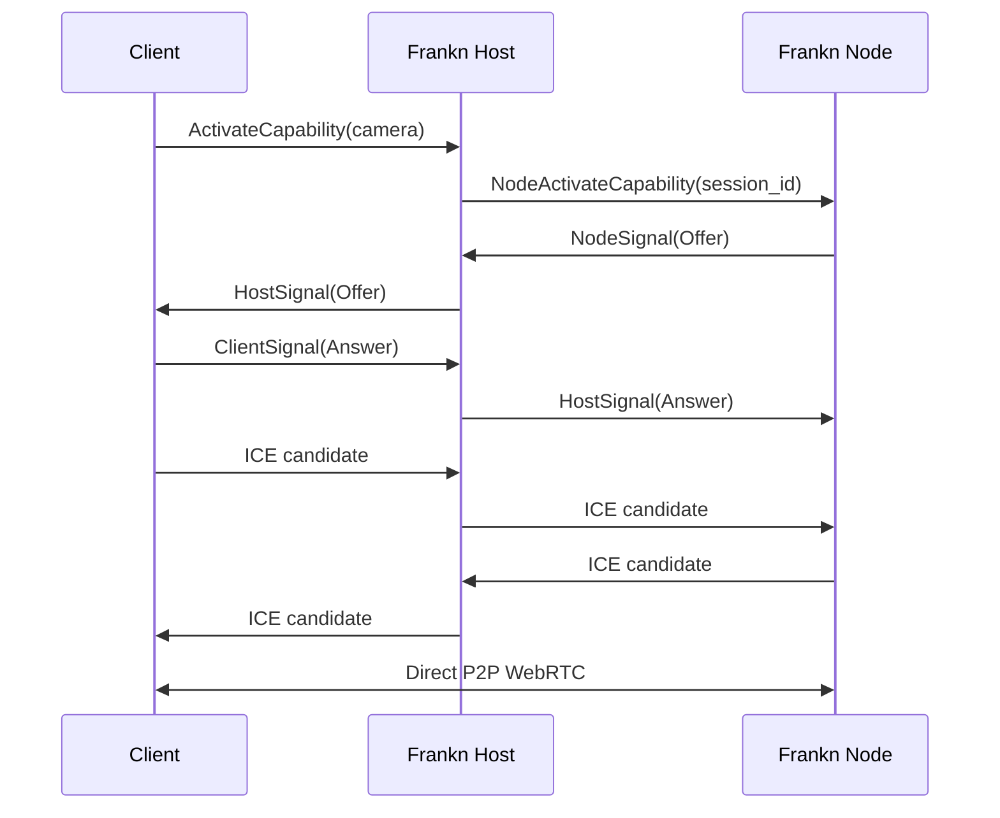

The Cloud Signaling Server is **not** used for the Client ↔ Node capability SDP/ICE exchange. It is used to establish and maintain the Host's control links with Clients and Nodes. The Host then performs the session-scoped signaling relay.

### The capability-session lifecycle

1. **Node Boot**  
   The Node Runtime starts, loads its configuration, and initializes its enabled capabilities.

2. **Node Registration**  
   The Node authenticates with the Host, registers its identity, and advertises its enabled capabilities.

3. **Capability Discovery**  
   The Client authenticates with the Host and receives the current capability inventory, including providers and availability.

4. **Session Activation**  
   The Client requests a capability. The Host resolves the provider, authorizes the request, creates a `CapabilitySession`, and sends an activation command to the Node.

5. **Session Signaling**  
   The Node creates a new RTC connection for that capability session and generates an SDP offer. The Host validates and relays the offer, answer, and ICE candidates between the Client and Node over their existing control links.

6. **Direct P2P Connection**  
   Client and Node establish a direct WebRTC connection. Capability traffic no longer passes through the Host or signaling infrastructure.

7. **Capability Use and Cleanup**  
   The Node runs the capability session, such as streaming camera video or publishing telemetry. When the session closes or fails, the Node and Host clean up the session state and associated resources.

### Camera session example

The camera capability follows the same model. The Node owns the camera hardware and media pipeline; the Host owns authorization and session coordination; the Client owns presentation.

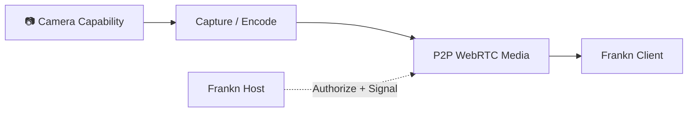

For a camera session, the Node creates the media connection on demand and publishes the VP8 video track directly to the Client. The Host only handles the lightweight control and signaling messages needed to establish that session.

---

## 🧠 Frankn Host Runtime

The **Host Runtime is authoritative**.

It is responsible for coordinating the private Frankn network rather than directly implementing every device capability.

Core responsibilities include:

- 🔐 Authentication and authorization
- 🧭 Capability discovery
- 🗂️ Capability/session registry
- 🧩 Node registration
- 📋 Policy and permissions
- 🔄 Session lifecycle
- 📊 Runtime state and telemetry
- 🤖 Optional automation and inference orchestration
- 🌐 Coordination with signaling infrastructure

Conceptually:

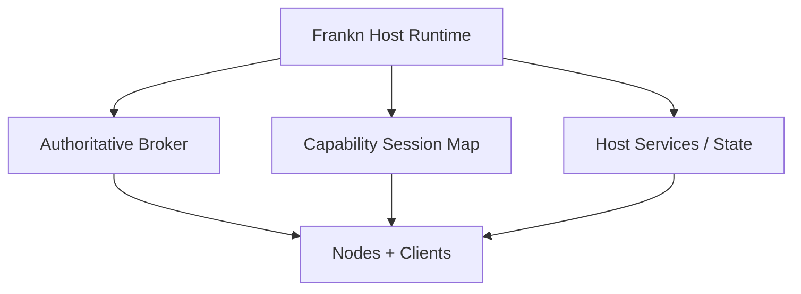

The Host should know **what** a capability is and **who is allowed to use it**.

It should not need to know every implementation detail of **how** the capability talks to the underlying hardware.

---

## 🧩 Frankn Node Runtime

The Node Runtime is the bridge between Frankn's abstract capability model and the actual device.

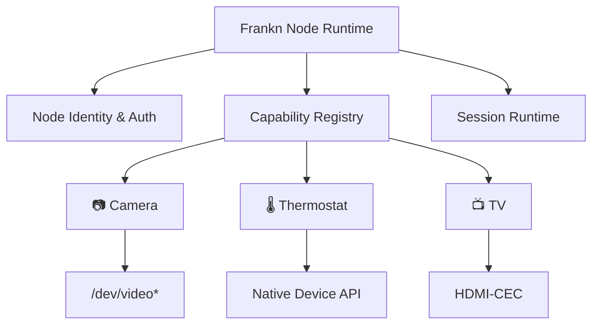

### Node Runtime responsibilities

- Load runtime configuration
- Establish node identity
- Authenticate with the Host
- Maintain Host connectivity and heartbeats
- Register enabled capabilities
- Advertise capability metadata
- Accept authorized capability sessions
- Dispatch sessions to capability handlers
- Manage capability lifecycle
- Interface with local hardware and operating-system APIs
- Expose capability data through the Frankn transport layer

The Node Runtime is therefore **not just another application**.

It is the device-side runtime boundary through which Frankn reaches the physical world.

---

## 📱 Frankn Client

The Client is intentionally separated from both the Host and the Node implementation.

Its job is to provide a user-facing interface for:

- 🔎 Discovering nodes
- 🧩 Browsing capabilities
- 🔐 Requesting capability sessions
- 🎛️ Controlling devices
- 📺 Rendering capability-specific UI
- 📷 Displaying camera/video streams
- 🌡️ Displaying thermostat state
- 💡 Controlling lights
- 📺 Controlling TVs
- 📁 Accessing files
- 💻 Opening terminal sessions
- 🎵 Controlling media
- 🤖 Interacting with optional inference capabilities

The Client should increasingly become **capability-driven rather than device-driven**.

Instead of binding the UI to a fixed device list, the Client should discover capability metadata first, resolve the provider, select the appropriate UI/controller, and then open the capability session.

That separation makes the Client much easier to extend as Frankn gains new node types.

---

## 📡 Signaling Infrastructure

Frankn uses a signaling service for **peer discovery and establishment of the Host control links**. It is not the capability-session data path.

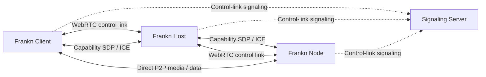

The signaling service can provide:

- Peer discovery
- Host control-link signaling
- SDP exchange for Host control links
- ICE candidate exchange
- STUN coordination
- Connection lifecycle signaling

For a Client ↔ Node capability session, the signaling server is **not** involved in the SDP/ICE exchange. The Host receives the session-scoped signals over the established control links, validates the `session_id` and sender identity, and forwards them to the other participant.

Once ICE negotiation succeeds, the Client and Node communicate directly over WebRTC.

---
## 🔐 Security Model

Frankn is designed around private, authenticated communication.

The architectural goal is:

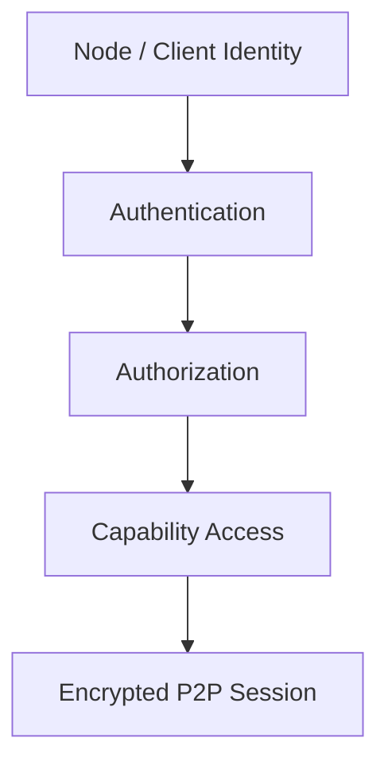

Security responsibilities are separated across layers:

| Layer | Responsibility |
| :--- | :--- |
| **Node Identity** | Establish which node is connecting. |
| **Host Authorization** | Decide whether the node/client is trusted and what it may access. |
| **Capability Policy** | Restrict access to specific capabilities or operations. |
| **WebRTC Transport** | Provide encrypted peer-to-peer transport. |
| **Capability Handler** | Enforce capability-specific validation and safety rules. |

Existing runtime security infrastructure includes:

- Zero-trust authentication
- Argon2id-based credential verification
- Sandboxed filesystem access
- Recursive path validation against traversal escapes
- Authenticated P2P sessions

---

## 🛠️ Capability Lifecycle

Capabilities follow a lifecycle managed by the Node Runtime and Host coordination layers:

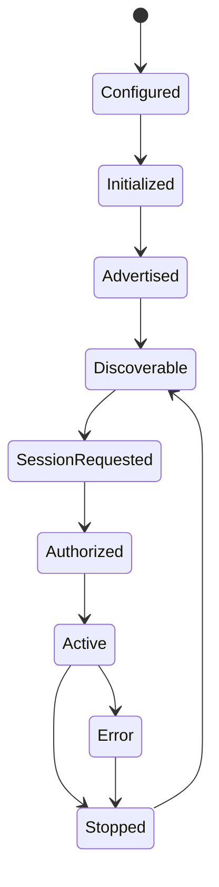

The important distinction is between **capability availability** and **capability sessions**.

A node can advertise `camera = available` without continuously streaming video.

A Client only creates the camera session when it actually requests the camera.

This keeps the runtime resource-efficient and makes capability activation explicit.

---

## 🧱 Current & Planned Capabilities

Frankn is intentionally not limited to one device category.

### 🖥️ System Capabilities

- Filesystem (`frankn_fs`)
- Terminal / SSH (`frankn_ssh`)
- System control
- Process management
- Input / remote control (`frankn_input`)

### 🎵 Media Capabilities

- Media playback control
- Audio mixer control (`frankn_media`)
- Track seeking
- Album-art / media telemetry

### 📷 Physical Device Capabilities (`INPROGRESS`)

- Camera / video
- 🎙️ Microphone / audio input
- 🌡️ Thermostat
- 📺 TV
- 💡 Lights
- Sensors
- Actuators
- Future smart-home and industrial devices

### 🤖 Intelligence Capabilities (`INPROGRESS`)

- LLM inference
- Vision
- Speech
- Embeddings
- Local AI agents

Inference remains optional. Frankn's networking and capability model must work perfectly without an LLM anywhere in the system.

### 🌐 Protocol / Hardware Bridges

Future capability providers can bridge:

- Matter
- MQTT
- Bluetooth / BLE
- HDMI-CEC
- Native Linux device interfaces
- Platform-specific APIs

The important rule is that these technologies become **implementation details of capabilities**, rather than becoming the architecture itself.

---

## 🔀 Transport & Protocol Lanes

Frankn can expose multiple logical capability lanes over the P2P transport.

| Protocol / Capability | Purpose |
| :--- | :--- |
| `frankn_cmd` | System commands, diagnostics, process/system control. |
| `frankn_fs` | Chunked binary file transfer with integrity validation. |
| `frankn_media` | Media telemetry and playback control. |
| `frankn_ssh` | Interactive terminal bridge. |
| `frankn_input` | Remote pointer, scrolling, and keyboard input. |
| `dohee_x` | Optional inference streaming lane. |

Dedicated logical lanes help prevent a large file transfer from starving latency-sensitive control traffic.

New capabilities should be able to introduce their own protocol contracts without requiring a rewrite of unrelated capabilities.

---

## 📡 Event Bus, State & Automation

Frankn's internal runtime can use event-driven coordination rather than tightly coupled capability-to-capability calls.

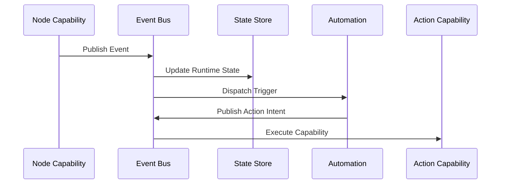

### ⚡ Event Bus

The Event Bus provides asynchronous coordination between runtime components and capabilities.

Capabilities publish events rather than requiring direct knowledge of every other capability.

### 💾 State Store

The State Store contains persistent configuration and runtime state needed across capability sessions and restarts.

### 🧠 Memory Service

Memory is a platform service, not an LLM feature.

Inference can consume memory, but capabilities should be able to use shared state without requiring an inference engine.

---

## 🤖 Inference Runtime

Inference is **one capability implementation**, not the center of Frankn.

That means:

- The core networking runtime does not require an LLM.
- Vision does not require the rest of Frankn to understand machine-learning internals.
- Speech can be exposed as a capability.
- Local LLMs can be exposed through an isolated inference service.
- Automation can optionally ask an inference capability for reasoning.

The architecture should remain useful even if every AI component is removed.

---

## 🧭 Architecture Boundaries

Frankn deliberately keeps the responsibilities of each runtime separate.

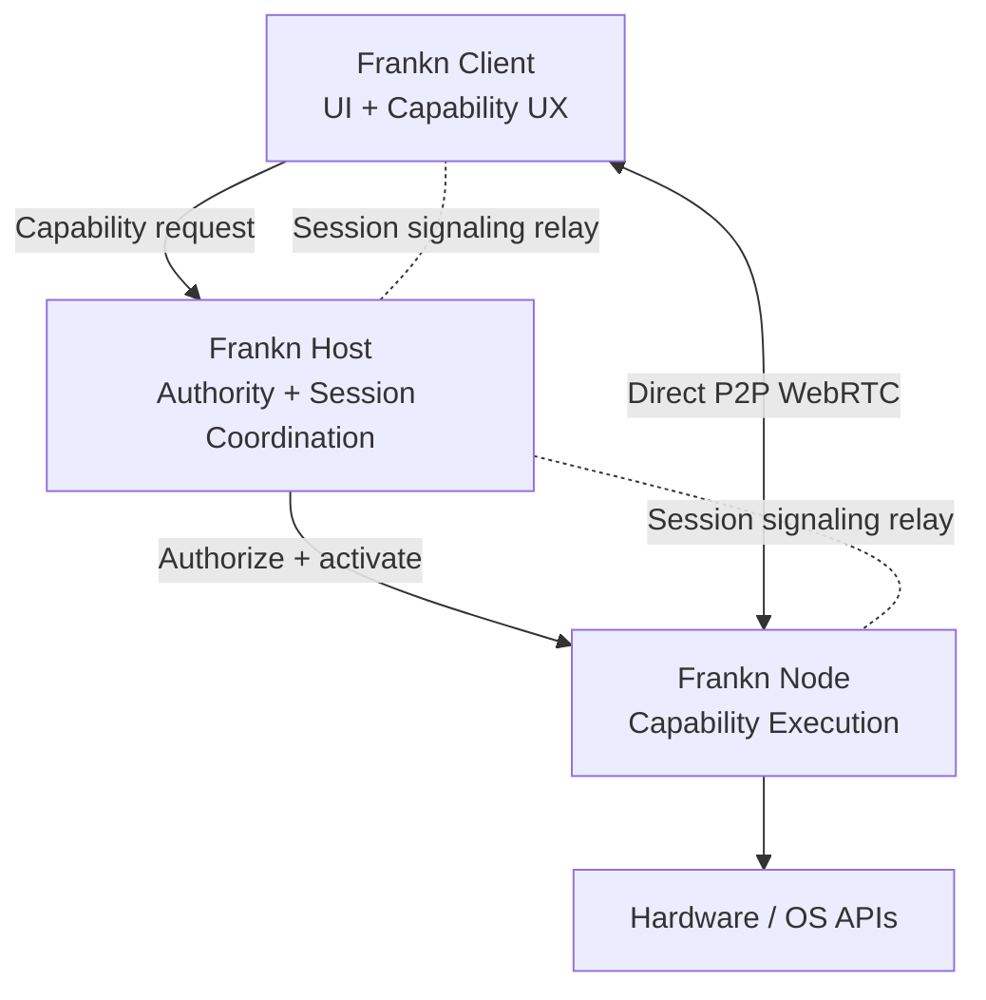

**Client owns presentation.**  
**Host owns authority and session coordination.**  
**Node owns hardware access and capability execution.**  
**Signaling infrastructure establishes the Host control links.**  
**The Host relays capability-session signaling.**  
**WebRTC carries the actual P2P capability traffic.**

---
## ❓ Why Frankn?

### Why not Home Assistant?

Home Assistant is primarily a smart-home automation platform.

Frankn is intended to be a more general-purpose **device networking runtime**, where smart-home capabilities are one category among many.

### Why not RustDesk / VNC?

Desktop remoting fundamentally revolves around pixels.

Frankn is capability-oriented.

A camera can stream video, but a thermostat should not need to pretend it is a video stream just because the client needs to interact with it.


---

## 🚀 Getting Started

### 1. Signaling Infrastructure

Build and run the Frankn signaling server:

```bash
cd frankn-signaling-server
cargo build --release
```

The signaling server provides the discovery/signaling infrastructure required for WebRTC peer establishment.

### 2. Frankn Host

Build/install the Host Runtime:

```bash
cd frankn-host
./install.sh
frankn-host pair
```

The Host becomes the authoritative controller for the private Frankn network.

### 3. Frankn Node

Start a Node Runtime on the device you want to expose.

The Node Runtime should:

1. Load its runtime configuration.
2. Determine which capabilities are enabled.
3. Initialize those capability providers.
4. Authenticate with the Host.
5. Register and advertise its capabilities.
6. Maintain its connection and heartbeats.
7. Wait for authorized capability sessions.

For example, a node configured with `camera`, `thermostat`, `tv`, and `lights` should advertise those capabilities to the Host without requiring the Host to contain hardware-specific implementations for each one.

### 4. Frankn Client

Build the Flutter client:

```bash
cd frankn
flutter pub get
flutter build apk
```

The Client connects to the Frankn network, discovers available nodes/capabilities, and provides the corresponding user interface.

---

## 🗺️ Architectural Roadmap

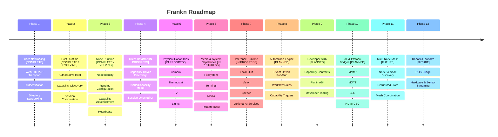

---

## 🌌 Long-Term Vision

Frankn is building a **private P2P networking runtime for the physical world**.

A workstation, camera, smart TV, thermostat, light controller, server, Raspberry Pi, robot, or future device should fit into the same basic model:

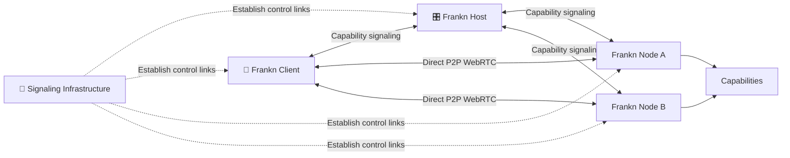

The goal is not to build another collection of device-specific applications. The goal is to provide a common runtime model for connecting software to the physical and virtual world.

**Build once.**  
**Expose as a capability.**  
**Discover anywhere.**  
**Connect directly.**  
**Compose into applications.**

> **Capabilities over applications.**  
> **Nodes over ecosystems.**  
> **P2P over unnecessary cloud relay.**  
> **Runtime before products.**


---

## 🧪 Project Status

Frankn is an actively evolving architecture rather than a finished commercial platform.

The core direction is now centered on:

**Host → Node → Capability → Session → P2P**

The project is deliberately moving away from treating individual device features as isolated application modules and toward treating them as capabilities exposed by a common networking runtime.

That distinction is the foundation for everything that comes next.

---

*Built with Rust and Flutter. Cyberpunk aesthetic intended.* ⚡
