# ⚡ FRANKN // Remote Operations Center

Frankn is a decentralized, personal Remote Operations Center designed for secure, low-latency, peer-to-peer management of servers and personal workstations. Built on the core philosophy of **"Intents over Pixels"**, it prioritizes streaming structured system metadata, command payloads, and binary file chunks over heavy, bandwidth-hogging video buffers. 

---

## 🏗️ Architecture & WebRTC Protocol Lanes

The system establishes direct, end-to-end encrypted WebRTC P2P connections between your devices, bypassing public cloud relays, virtual private networks, or complex port forwarding. Initial discovery and handshake exchanges (SDP/ICE) are handled by a lightweight, self-hosted Signaling middleman.

```
┌─────────────────────────────────┐           ┌─────────────────────────────────┐
│         FLUTTER CLIENT          │◄─────────►│            RUST HOST            │
│         (Mobile App)            │  WebRTC   │        (System Daemon)          │
│   Immersive Command Terminal    │           │   Direct D-Bus & Linux APIs     │
└─────────────────────────────────┘           └─────────────────────────────────┘
                 │                                             │
                 └──────────►┌─────────────────────────┐◄──────┘
                             │  RUST SIGNALING SERVER  │
                             │   (Secure Handshakes)   │
                             └─────────────────────────┘
```

Once paired, communication is multiplexed across specialized, high-performance WebRTC Data Channels:

| Data Channel | Operation | Description |
| :--- | :--- | :--- |
| `frankn_cmd` | System Control | Handles process diagnostics, systemd power states, and command dispatching. |
| `frankn_fs` | Binary Storage | Manages chunked, high-speed file transceivers with SHA-256 integrity validation. |
| `frankn_media` | Media Telemetry | Bidirectional audio mixer tracking, album art synchronization, and stream scrubbing. |
| `frankn_ssh` | Terminal Bridge | Establishes a raw xterm SSH bridge with Nerd Font support and session restoration. |
| `frankn_input` | Remote Input | Batches precise Pointer movements, scroll metrics, and virtual keypresses. |
| `dohee_x` | Neural Chat | Secure, isolated local LLM streaming thread connecting to the host `llama-server`. |

---

## 📸 Cyberpunk User Interface

<div align="center">
  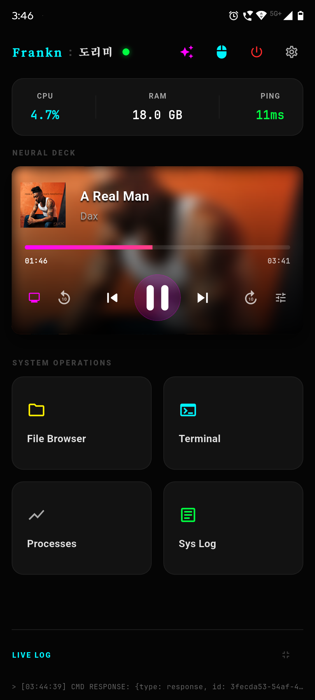
  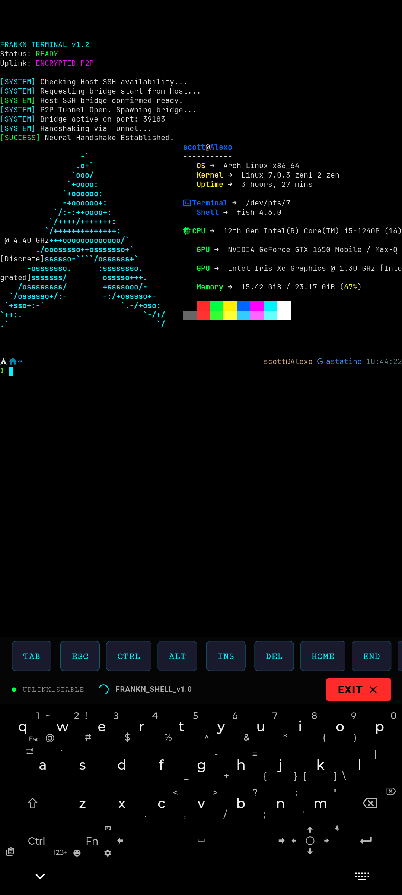
  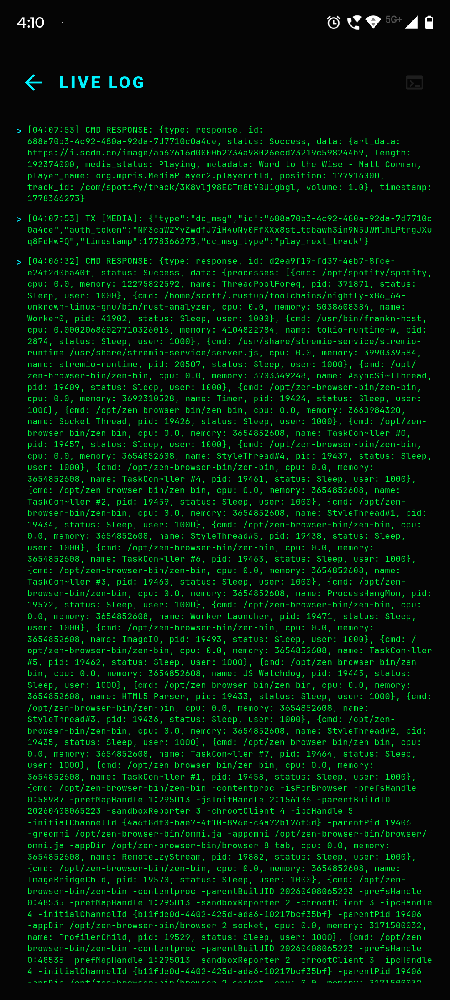
  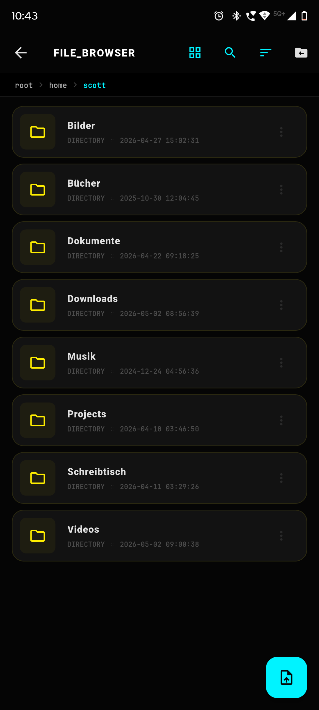
  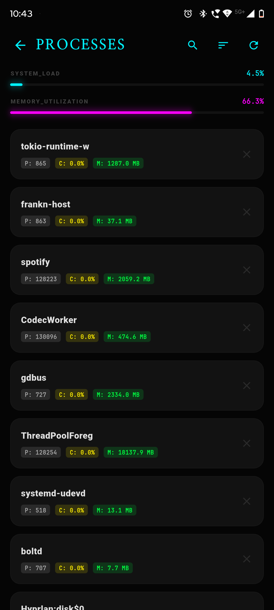
  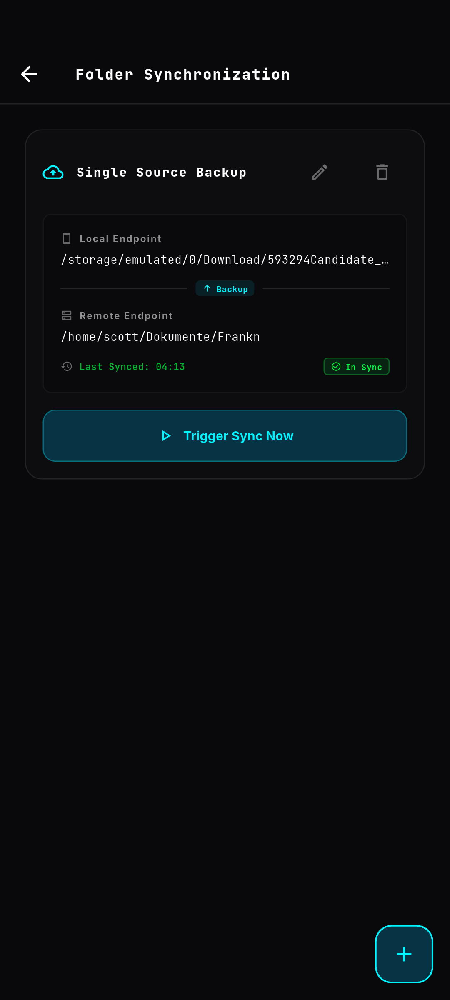
</div>

<br>

<details>
<summary><b>👀 View more system interface telemetry</b></summary>
<br>
<div align="center">
  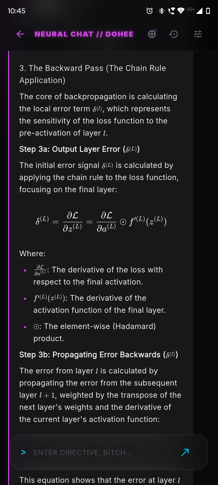
  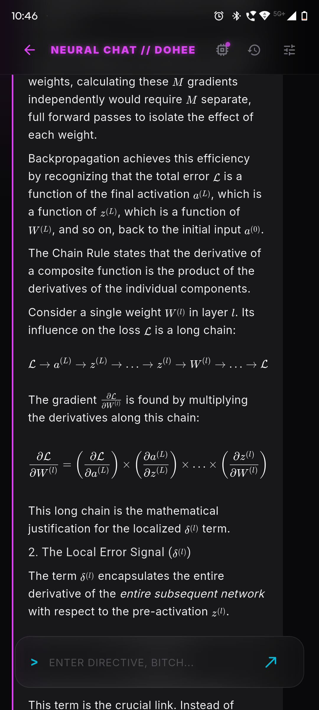
  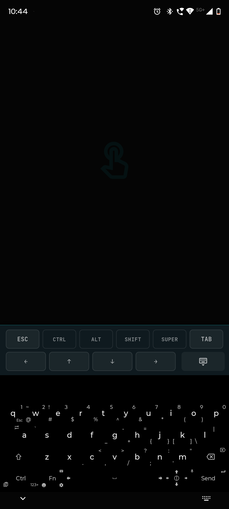
  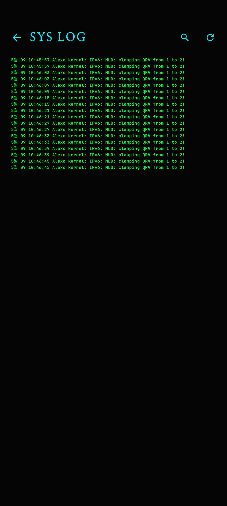
  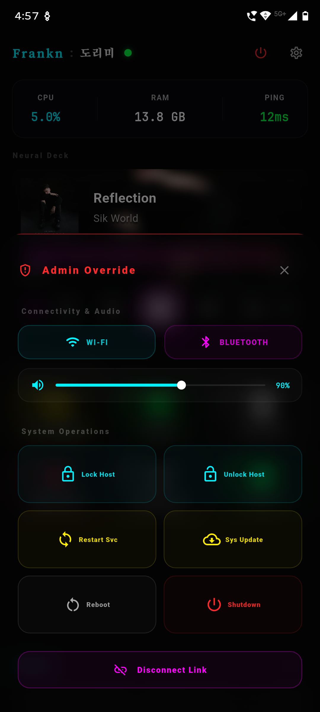
  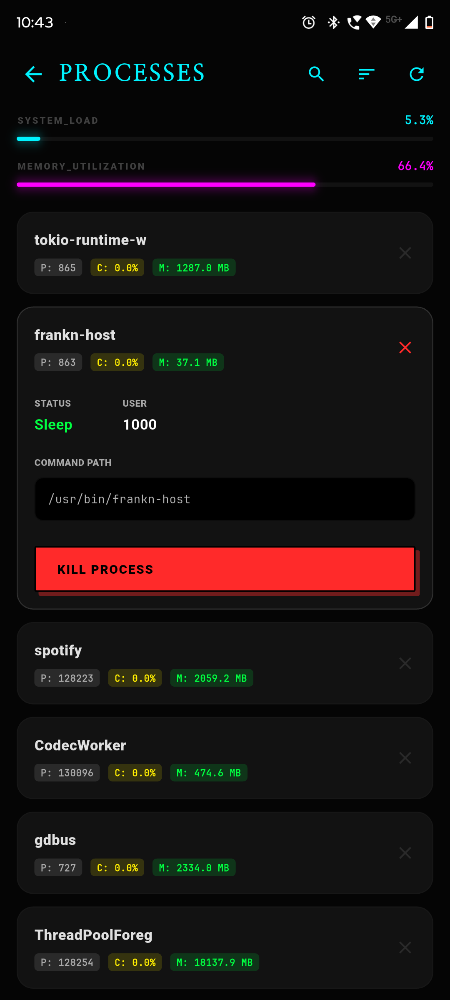
  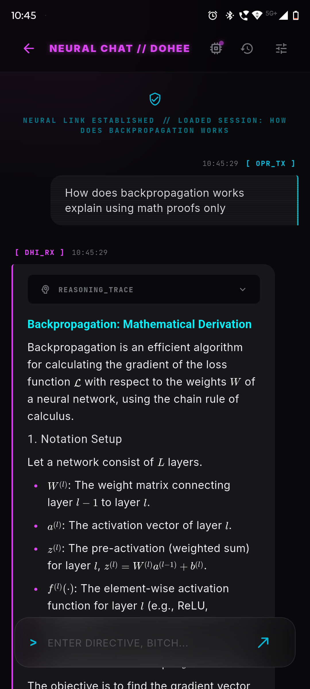
  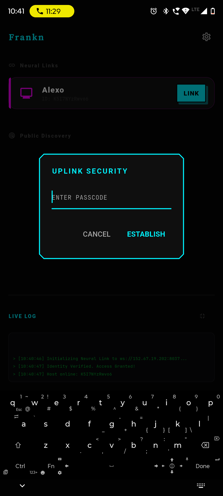
  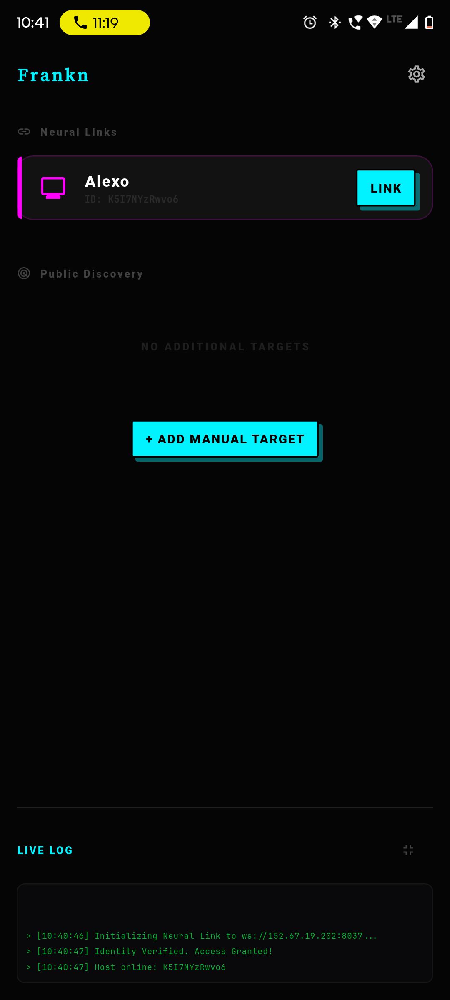
  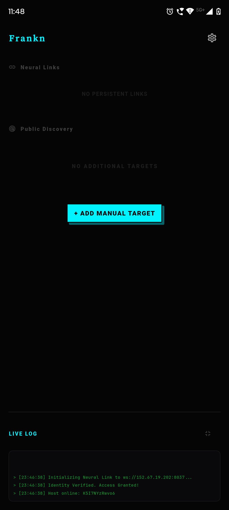
  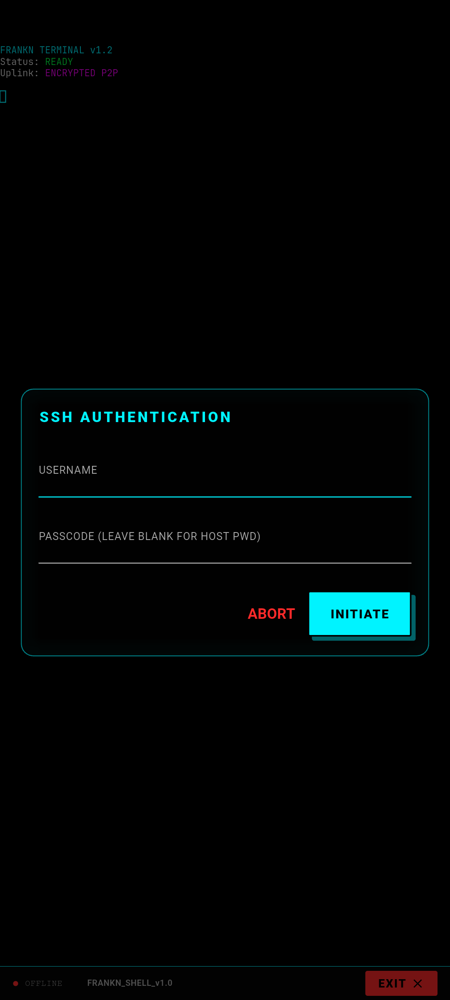
  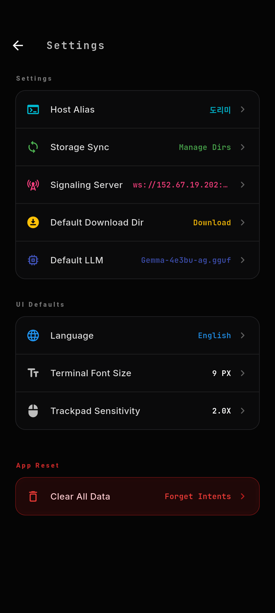
  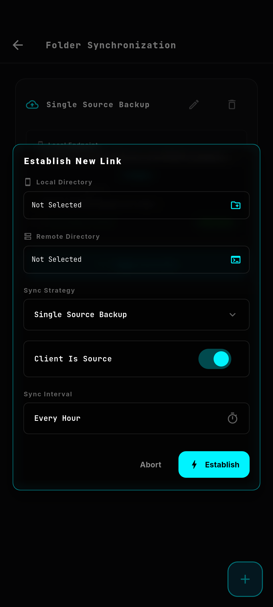
</div>
</details>

---

## 🦸‍♂️ Capabilities & Core Features

### 🔐 Zero-Trust Cryptographic Security
* **Constant-Time Argon2id Auth:** Hardened challenge-response pairing protocol utilizing `subtle` verifiers to mitigate timing side-channel attacks.
* **Home Directory Sandboxing:** Enforces strict local directory barriers (`dirs::home_dir()`), recursively walking path structures to completely prevent parent directory traversal escapes.
* **RAII Resource Management:** Connection handshakes automatically purge active file descriptors and memory-held signaling bindings upon link drop.

### 📁 Advanced Files Orchestration
* **Android Storage API Bypass:** Integrated a custom pure-Dart directory traversal engine listing folders asynchronously in sub-milliseconds to avoid native Storage Access Framework Tree crashes.
* **Custom Landing Directories:** Supports persistent download landing configurations alongside dynamic, on-demand routing controls to choose custom storage targets for individual transfers.
* **Frosted Glassmorphic Context Sheets:** File items display responsive telemetry diagnostics (size, type, and subsystem origin) inside custom frosted blurs with icon-guided operations.
* **High-Speed Transfer Throttling:** Restricts Native progress redraws to a strict 2Hz limit, keeping the client completely fluid and responsive during gigabit-level P2P transfers.

### 🎬 Media Synchronization
* **Real-time State & Seek Sync:** Bidirectional streaming of workstation volume mixers (WirePlumber/PulseAudio), track details, and album art with gesture-based track seeking.

### 🖥️ Precise Workstation Inputs
* **Precision HUD Trackpad:** Supports 1-finger long-press drag gestures, 3-finger middle-click taps, and dual-state modifier key locking (Ctrl, Alt, Shift, Super) mapped directly to host `uinput` Linux virtual keys.
* **Terminal Shell & Session Restoration:** Persistent terminal sessions over WebRTC with sticky modifiers and in-memory SSH credential caching for seamless reconnections.

---

## 🚀 Getting Started

### 1. Matchmaker (Signaling)
Run this lightweight middleman on a VPS or public IP to facilitate the WebRTC handshakes:
```bash
cd frankn-signaling-server
cargo run --release
```

### 2. Workstation Host
Run this on the machine you want to command. First-time startup launches an interactive configurator.
```bash
cd frankn-host
./install.sh
```
To pair your client, launch the interactive QR code generator:
```bash
frankn-host pair
```

### 3. Mobile Client
Compile the Flutter engine and connect to your hosts:
```bash
cd frankn
flutter pub get
flutter run
```

---

## ⚠️ Troubleshooting & P2P Connectivity over Mobile Hotspots (TODO)

When running the mobile client (phone) and host (laptop) on the **same mobile hotspot** (where the laptop is connected to the phone's hotspot sharing cellular data), you may see both devices marked as **online** via the signaling server, but they will fail to establish a direct WebRTC peer connection.

### Root Cause
1. **AP Isolation & Gateway Firewall**: The phone's operating system (Android/iOS) implements a strict firewall on the virtual hotspot interface. It allows outbound WAN cellular routing, but blocks incoming UDP/TCP connection attempts from local hotspot client devices (the laptop) to local ports open on the gateway device (the phone).
2. **Symmetric CGNAT & NAT Loopback**: Cellular carriers employ Carrier-Grade NAT (CGNAT) with Symmetric NAT rules. Under this layout, STUN candidate hole-punching fails because public ports are randomized per destination, and carriers block NAT loopback/hairpinning (routing packets from and back to the same public IP).
3. **No TURN Server Relay**: The current connection layouts in [rtc_connection.dart](file:///home/scott/Projects/Frankn/frankn/lib/services/client_rtc/rtc_connection.dart#L80) and [rtc.rs](file:///home/scott/Projects/Frankn/frankn-host/src/ops/rtc.rs#L53) only configure STUN servers, offering no fallback media relay.

### Developer Workarounds (No Code Changes Required)
* **Workaround A (Recommended)**: Enable the Wi-Fi hotspot on your **laptop** instead, and connect your **phone** to it. The client (phone) can easily connect outward to the gateway ports on the laptop, bypassing gateway-to-client firewall drops.
* **Workaround B**: Connect both your phone and laptop to a standard home/office Wi-Fi router (P2P routing is allowed locally).

### Future Roadmap TODOs
- [ ] **TURN Relay Configuration**: Add support for managed/self-hosted TURN (coturn) servers to relay data when direct P2P routing is blocked.
- [ ] **Reversed TCP Sockets Fallback**: Implement a local fallback connection mode where the host listens on a passive TCP port and the phone connects outward to the laptop's IP directly.
- [ ] **WebRTC TCP Candidate Binding**: Configure passive/active TCP candidate pairs (`tcp-passive` on host, `tcp-active` on client) for WebRTC over TCP.

---

## 🗺️ Progress Checklist & Project Path

**Current Phase:** Phase 5 (Advanced Protocols Integration)
- [x] WebRTC End-to-End Encrypted Transport & Argon2id Verifications
- [x] Host Configuration Provider (TOML) with custom path selectors (`-c` flags)
- [x] Workstation Configuration TUI & Vim-based binds
- [x] Secure QR Code Handshakes, 12-digit Unique IDs, & Screenshot Import
- [x] Workstation Control Nodes (Systemctl, D-Bus, Hyprlock, Process managers)
- [x] Immersive Terminal Emulator & Synced Viewer
- [x] Frosted Glassmorphism Context UI & Neon Sorting Panels
- [x] Bidirectional Storage Synchronizations (Sequenced batch folder mirroring)
- [x] Precise Virtual Remote Pointer & Multi-touch gestures
- [ ] Neural Chat & Local LLM Chat Thread (`LlmManager` streaming & persistence)
- [ ] Mobile-as-Host Protocol (Reverse controller logic)

---

*Built with Rust and Flutter. Cyberpunk aesthetic intended.*
