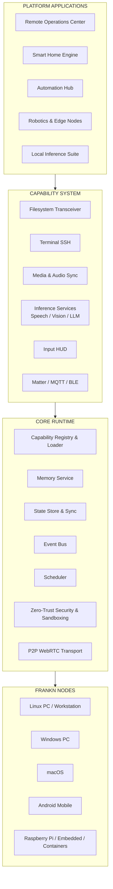
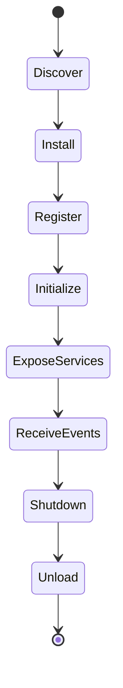
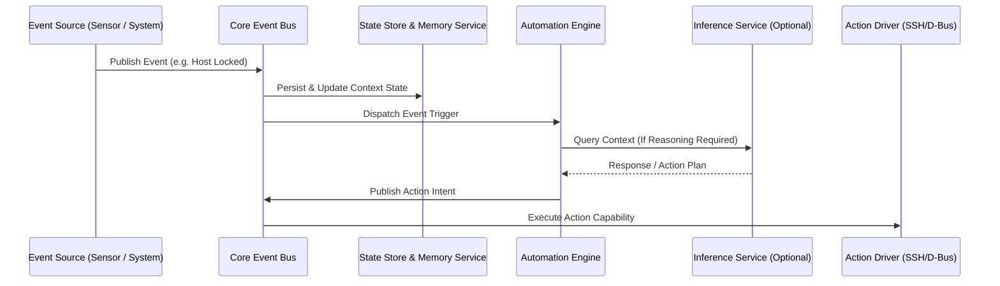
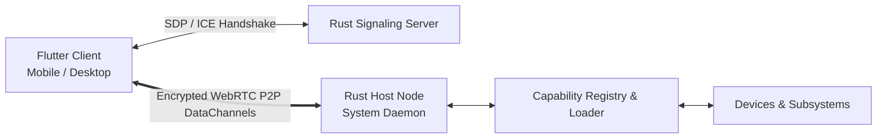
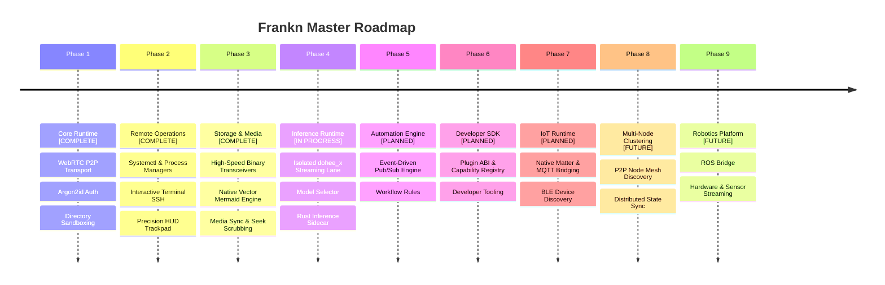

> **Capabilities over applications.**  
> **Runtime before products.**  
> **Local before cloud.**  

# ⚡ Frankn

> **A modular, local-first runtime for distributed devices.**  
> *Program your devices, not their ecosystems. Build capabilities once, deploy them anywhere.*

Frankn is a capability-oriented runtime designed to unify remote administration, automation, local inference, and heterogeneous devices under a single programmable platform. 

Rather than being another smart-home application or remote desktop solution, Frankn provides a reusable runtime where independent capabilities can be composed into products such as remote operations centers, smart homes, robotics, industrial automation, and local inference systems.

Applications solve problems.  
Platforms enable solutions.  
Runtimes enable platforms.  

**Frankn is building the runtime.**

---

## 📜 Philosophy

Modern software is built around monolithic applications. Frankn is built around reusable capabilities.

Applications become compositions of capabilities rather than rigid programs. A filesystem capability can power a remote operations center today, a smart home tomorrow, and an autonomous robot in the future.

The runtime remains unchanged. Only the composition changes.

> **Engineering Discipline**: *Every new capability must justify its existence by making the runtime more reusable, not just more feature-rich.*

---

## 💡 What is a Runtime?

The **Frankn Runtime** is responsible for hosting capabilities, managing their lifecycle via the **Capability Registry**, coordinating pub/sub event communication, enforcing zero-trust security, and exposing a unified execution environment.

* **Platform Applications** are built on top of the runtime.
* **Capabilities** extend the runtime.
* **Nodes** execute the runtime.

---

## 🎯 Why Frankn?

Modern devices and computing infrastructure are deeply fragmented:

* Your PC has one management interface (SSH / RDP).
* Your NAS has another (Web GUI / Samba).
* Your smart lights have another (Home Assistant / Proprietary Cloud).
* Your cameras have another (RTSP / NVR).
* Your inference models have another (OpenAI API / Local LLMs).

Frankn unifies them into **one programmable runtime**. Instead of learning and maintaining five separate ecosystems, you extend one platform.

> *Frankn replaces fragmented device-specific software with a single programmable runtime where every node speaks the same architectural language.*

---

## 📐 Design Principles

* **Local-First**: All computation, authentication, and state management prioritize local execution without public cloud relay dependencies.
* **Capability-Oriented**: Subsystems are exposed as standalone, modular capabilities rather than tightly coupled features.
* **Privacy by Default**: End-to-end encrypted WebRTC P2P transport with zero third-party telemetry or cloud storage.
* **Intents Over Pixels**: Streams structured data (file chunks, process states, terminal strings, input events) rather than bandwidth-heavy video buffers.
* **Event-Driven**: Asynchronous pub/sub event bus architecture for ultra-low latency coordination.
* **Modular**: Core runtime contains zero domain-specific logic; applications are composed via capabilities.
* **Transport-Agnostic**: Multiplexed data channels operate seamlessly over local networks, STUN WebRTC, or custom sockets.
* **Inference Optional**: Inference (LLMs, vision, speech, embeddings) is one implementation of the capability framework, not a special subsystem. The runtime remains 100% functional without inference services.
* **Extensible**: Designed for seamless addition of new nodes, protocols (Matter, MQTT, Bluetooth), and automation workflows.

---

## 🏗️ Conceptual Architecture



---

## 🌐 The Concept of a Node

Every device running Frankn becomes a **Node**.

* **Definition**: Nodes may represent physical devices, virtual machines, containers, or embedded systems.
* **Capability Exposure**: Nodes host and expose capabilities (e.g., system control, file access, media streaming, inference services) registered through the **Capability Registry**.
* **Inter-Node Mesh**: Capabilities can be consumed locally or remotely through cryptographically authenticated P2P sessions.

---

## 🛠️ Capability System & Discovery

Capabilities follow a strict lifecycle managed by the Core Runtime's **Capability Registry & Loader**:



### Infrastructure vs Built-in Capabilities

| Category | Component | Rationale & Description |
| :--- | :--- | :--- |
| **Infrastructure** | Zero-Trust Argon2id Auth | Constant-time verifiers preventing side-channel timing attacks. |
| **Infrastructure** | Home Directory Sandbox | Recursive ancestor path checking to prevent parent traversal escapes. |
| **Infrastructure** | Intent Handler (`ACTION_VIEW`) | Native Android intent opener routing local code/MD files directly into Frankn. |
| **Capability** | Filesystem (`frankn_fs`) | High-speed chunked binary file transfer engine with custom landing selection. |
| **Capability** | Terminal SSH (`frankn_ssh`) | Interactive xterm terminal with sticky modifiers (`CTRL`/`ALT`/`SHIFT`) & persistent sessions. |
| **Capability** | Native Mermaid Vector Engine | Pure Dart vector flowchart renderer (**zero Webview dependency**, 100% cross-platform). |
| **Capability** | Media & Mixer (`frankn_media`) | Bidirectional audio controls (WirePlumber/PulseAudio) with interactive track seeking. |
| **Capability** | Input HUD (`frankn_input`) | Multi-touch trackpad with 1-finger drags, 3-finger middle clicks, and uinput key mapping. |
| **Capability** | Inference Runtime (`dohee_x`) | Optional inference services (LLMs, speech, vision) via Rust `llama-server` sidecar. |

---

## 📡 Event Bus, State Store & Memory Service



### ⚡ Event Bus
The **Event Bus** is the internal coordination layer. Capabilities communicate by publishing and subscribing to events rather than invoking one another directly.

### 💾 State Store
The **State Store** manages persistent configuration, active runtime state, and inter-node synchronization across session boundaries.

### 🧠 Memory Service
**Memory is a platform service, not an LLM feature.** Capabilities store, retrieve, or subscribe to contextual state information through a shared memory layer. Inference services simply consume this platform memory service like any other capability.

---

## 🔀 System Topology & Data Channels



### Isolated Protocol Lanes

| Protocol Lane | Subsystem | Rationale & Description |
| :--- | :--- | :--- |
| `frankn_cmd` | System Control | Process diagnostics, systemd power states, and D-Bus command dispatching. |
| `frankn_fs` | Binary Storage | Chunked binary file transceivers with SHA-256 integrity validation. |
| `frankn_media` | Media Telemetry | Real-time audio mixer tracking, album art synchronization, and stream scrubbing. |
| `frankn_ssh` | Terminal Bridge | Raw xterm SSH bridge with sticky modifier key states & session restoration. |
| `frankn_input` | Remote Input | Batched pointer movements, scroll metrics, and virtual keypresses. |
| `dohee_x` | Inference Runtime | Isolated inference streaming lane connecting to host inference daemons. |

*Rationale:* Dedicated protocol lanes prevent head-of-line blocking and isolate latency-sensitive input events from high-throughput binary transfers. *Additional protocol lanes can be introduced dynamically without modifying existing capabilities.*

---

## 🤖 Inference Runtime

Inference (speech, vision, LLMs, embeddings) in Frankn is **one implementation of the capability framework, not a special subsystem**.

* The core runtime has **zero dependency on inference models**.
* The inference subsystem communicates through an isolated sidecar daemon (`llama-server`) and a dedicated Rust client library.
* System capabilities (files, terminals, media, commands) remain 100% operational whether inference services are enabled or disabled.

---

## ❓ Why Not...? (FAQ)

* **Why not SSH?**  
  *SSH provides terminal access. Frankn provides a programmable capability runtime.*
* **Why not Home Assistant?**  
  *Home Assistant focuses on smart home automation. Frankn focuses on a general-purpose edge device runtime.*
* **Why not RustDesk / VNC?**  
  *RustDesk streams desktop pixels. Frankn streams structured intents and capabilities.*

---

## 🚀 Getting Started

### 1. Matchmaker (Signaling)
```bash
cd frankn-signaling-server
cargo build --release
```

### 2. Workstation Host Node
```bash
cd frankn-host
./install.sh
frankn-host pair
```

### 3. Mobile / Desktop Client
```bash
cd frankn
flutter pub get
flutter build apk
```

---

## 🗺️ Architectural Roadmap



---

## 🌌 Long-Term Vision

Frankn is building a **programmable runtime for the physical world**.

Whether a node is a workstation, a smart home hub, a server rack, an edge camera, or a robot — the programming model remains the same.

* **Build once.**
* **Deploy anywhere.**
* **Capabilities over applications.**
* **Runtime before products.**

---

*Built with Rust and Flutter. Cyberpunk aesthetic intended.*
