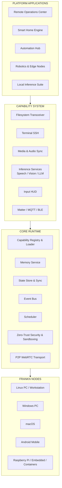
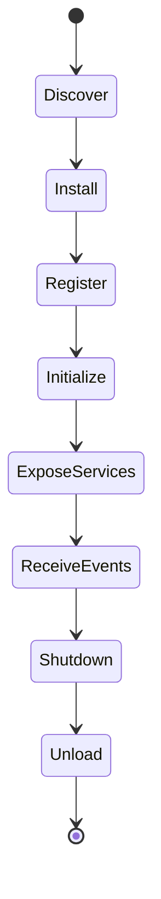
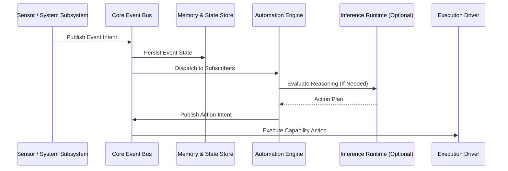
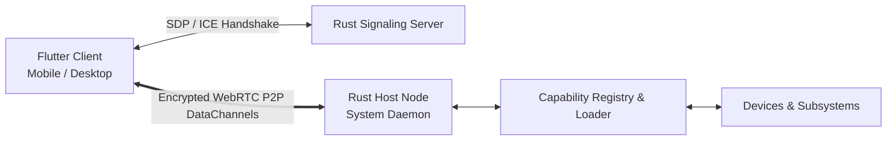

# 📐 Frankn Architecture Specification

> **Capabilities over applications.**  
> **Runtime before products.**  
> **Local before cloud.**  

This document details the internal technical architecture, subsystem interactions, security boundaries, and execution models of the **Frankn Runtime**.

---

## 1. Architectural Philosophy

Frankn decouples physical edge hardware and high-level applications by introducing a **capability-oriented runtime**.

---

## 2. Core Runtime Services

### A. Capability Registry & Loader (`R1`)
The **Capability Registry** discovers, loads, registers, validates permissions, and manages the lifecycle of runtime capabilities.

### B. Memory Service & State Store (`R2`, `R3`)
* **Memory Service**: Platform-level contextual memory service. Capabilities store, retrieve, or query state context. Inference services consume this memory service as a platform utility rather than embedding context state locally.
* **State Store**: Manages persistent node settings (`TOML`), active session structures, paired host tokens, and inter-node synchronization.

### C. Core Event Bus (`R4`)
Asynchronous pub/sub coordination layer. Capabilities communicate by publishing events to topic queues rather than directly coupling to one another.

---

## 3. Communication & P2P Transport Layer (`R7`)

### Multiplexed Protocol Lanes
To prevent head-of-line blocking and ensure real-time responsiveness, Frankn multiplexes communication across dedicated WebRTC Data Channels:

| Protocol Lane | Workload Type | Description & Purpose |
| :--- | :--- | :--- |
| `frankn_cmd` | Low-latency control | Diagnostics, systemd power states, D-Bus commands, process managers. |
| `frankn_fs` | High-throughput binary | Chunked file transceivers, SHA-256 integrity validation, directory sync. |
| `frankn_media` | Telemetry & Control | MPRIS track synchronization, WirePlumber/PulseAudio mixers, seek scrubbing. |
| `frankn_ssh` | Interactive Terminal | Raw xterm bridge, sticky modifier key states (`CTRL`/`ALT`/`SHIFT`), background session re-attachment. |
| `frankn_input` | Real-time Pointer | Batched pointer movements, scroll metrics, virtual uinput keypresses. |
| `dohee_x` | Streaming Text | Isolated inference streaming lane connecting to host inference daemons. |

---

## 4. Zero-Trust Security & Sandboxing (`R5`)

1. **Argon2id Cryptographic Verification**: Challenge-response handshake utilizing constant-time comparison primitives (`subtle` crate) to prevent side-channel timing attacks.
2. **Home Directory Sandboxing**: Enforces strict directory barriers (`dirs::home_dir()`), recursively walking path structures to block parent path traversal escapes.
3. **RAII Teardown**: Link drops immediately purge socket descriptors, background threads, and memory-held signaling bindings.

---

## 5. Engineering Discipline

> **Every new capability must justify its existence by making the runtime more reusable, not just more feature-rich.**

---

*Frankn Architectural Specification — July 2026*
