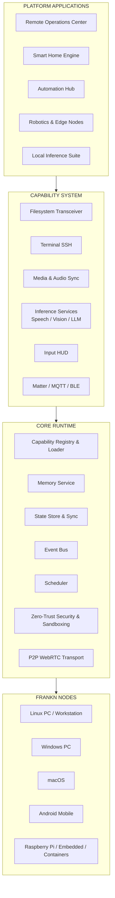
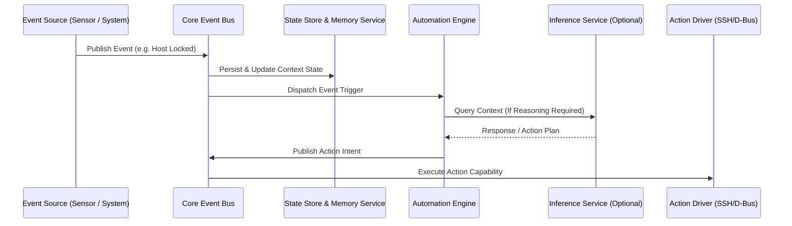
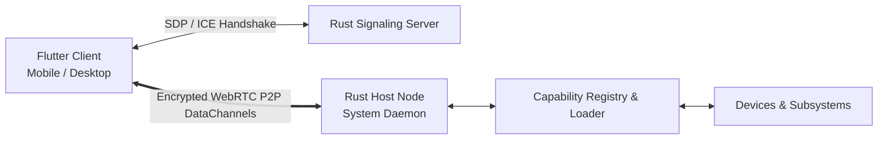
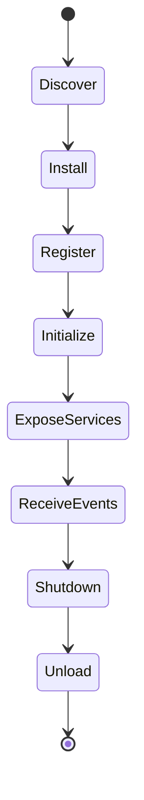
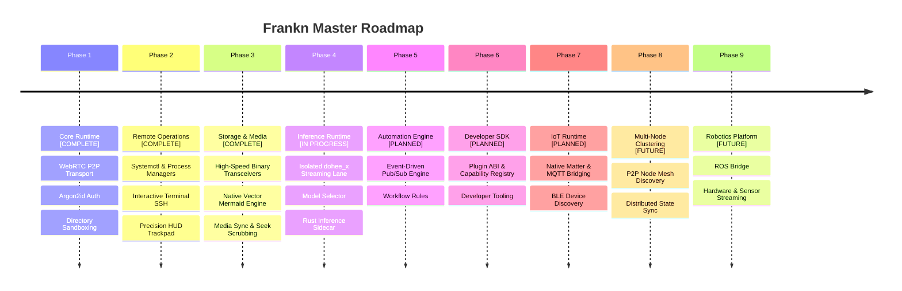

# ⚡ Frankn: Master Edge Runtime Architecture & Technical Blueprint

> **Capabilities over applications.**  
> **Runtime before products.**  
> **Local before cloud.**  

This document serves as the master technical blueprint for **Frankn**, a modular, local-first runtime for distributed devices.

---

## 📜 1. Philosophy & Engineering Discipline

Frankn is built on the core principle of **Platform over Product**:

1. **Applications Solve Problems, Runtimes Enable Platforms:** Remote administration, inference engines, smart homes, and robotics are not hardcoded monolithic applications—they are composable capabilities running on top of a unified runtime.
2. **Engineering Discipline:** *Every new capability must justify its existence by making the runtime more reusable, not just more feature-rich.*
3. **Intents Over Pixels:** Avoids heavy video streaming (VNC/RDP). Streams structured intents (binary chunks, system metrics, terminal strings, input events) across dedicated P2P WebRTC data channels.
4. **Zero-Trust & Local-First:** Argon2id challenge-response authentication, constant-time timing-attack mitigations (`subtle`), home directory sandboxing (`dirs::home_dir()`), and zero reliance on public cloud relays.

---

## 🏗️ 2. Layered System Architecture

---

## 📡 3. Event Bus, State Store & Memory Service Architecture

---

## 🔀 4. Data Channels & Topology

### Protocol Lane Isolation
* `frankn_cmd`: System diagnostics, process managers, D-Bus, and power states.
* `frankn_fs`: High-speed binary storage transfers with SHA-256 validation.
* `frankn_media`: MPRIS track synchronization, WirePlumber/PulseAudio volume controls, and seek scrubbers.
* `frankn_ssh`: Raw terminal bridge backed by sticky modifier key states and persistent background session restoration.
* `frankn_input`: Batched pointer movements, scroll metrics, and virtual key mapping.
* `dohee_x`: Real-time streaming thread connecting to host inference daemons (`llama-server`).

*Note: Additional protocol lanes can be introduced dynamically without modifying existing capabilities.*

---

## 🛠️ 5. Capability Discovery & Lifecycle

---

## 💻 6. Current Implementation Details

### A. Rust Node Runtime (`frankn-host`)
* **Security & Sandboxing:** Constant-time Argon2id verifiers, ancestor-validated path sandboxing, and RAII resource teardown on link drop.
* **Linux Integrations:** Direct D-Bus bindings for systemd power management, loginctl sessions, Hyprlock background processes, and PulseAudio/WirePlumber audio controls.
* **Storage Engine:** Multi-threaded directory indexing, chunked binary transfers, and `notify`-backed directory monitoring.
* **Inference Subsystem:** Modular `LlmManager` orchestrating model selection, persistent session mapping (`chats.json`), and server-sent event streaming.

### B. Flutter Multi-Platform Client (`frankn`)
* **Native Vector Diagram Engine (`neo_mermaid_widget.dart`)**: Pure Dart Mermaid flowchart parser and vector renderer with full-screen interactive zoom/pan modal (**zero Webview dependency**, 100% Linux Desktop compatible).
* **System File Intent Handler (`ACTION_VIEW`)**: Native file opener on Android routing `.md`, `.txt`, `.json`, `.py`, `.rs`, `.dart` files directly to viewer/editor screens.
* **Persistent SSH Session Restoration**: Back navigation keeps the active SSH WebRTC tunnel and terminal buffer alive in memory for instant re-attachment; explicit exit button tears down the shell.
* **Precision HUD Trackpad**: Touch gestures including 1-finger drags, 3-finger middle clicks, and sticky/locked modifier key states (`CTRL`, `ALT`, `SHIFT`).

---

## 🗺️ 7. Master Architectural Roadmap

---

*Master Technical Blueprint — Last Updated: July 2026*
